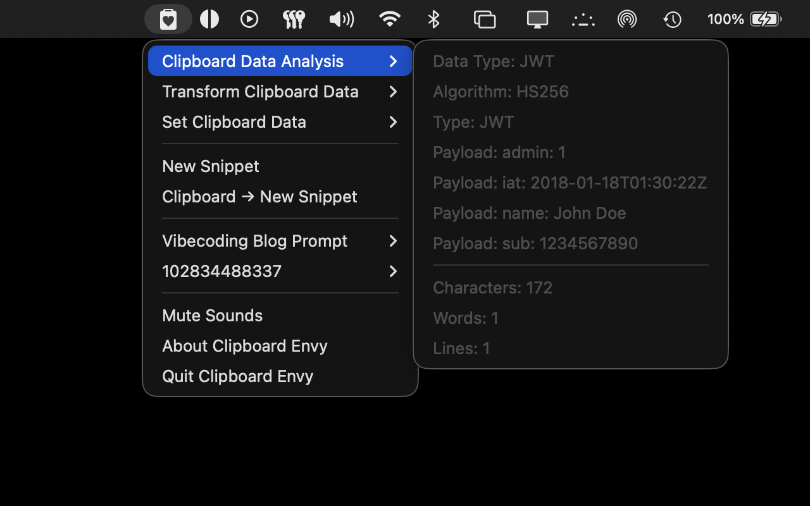
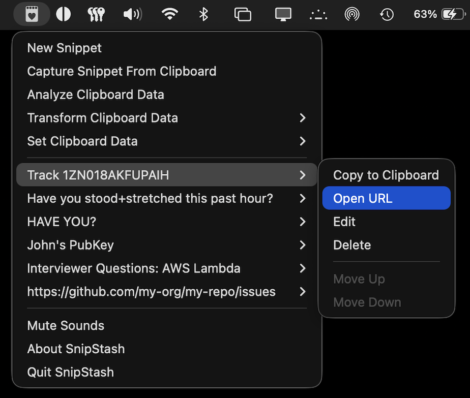

#  Clipboard Envy [](https://apps.apple.com/us/app/clipboard-envy/id6759918875)

A lightweight, developer-focused macOS Menu Bar-only app for managing and transforming Clipboard data.

Clipboard Envy is [available in the App Store](https://apps.apple.com/us/app/clipboard-envy/id6759918875) or can be downloaded directly from [this project's releases](https://github.com/centennial-oss/clipboard-envy/releases).

## About

Clipboard Envy lives in your Menu Bar so you can capture, store, transform, and recall text snippets without leaving your workflow. It's ideal for developers who use tools like JWT Decoders, SHA-1 Hashers, JSON Minifiers, etc. We have over 100 built-in tools, organized in a coherent, easy-access Menu.

In addition to developer tools, Clipboard Envy is great for the average user to do things like:
- Quickly capture snippets that you don't want to lose, like tracking numbers
- Blocks of text you need to temporarily stash somewhere while rearranging an article or paper
- Frequently used snippets (boilerplate, shell commands, links, public keys, how-to steps)

## Features

- **Menu Bar access** — Runs only in the macOS Menu Bar for quick access
- **Capture Snippet from Clipboard** — One-click to save the current clipboard contents to the stash
- **Create, Edit, and Arrange Snippets** — Edit and manually create snippets with custom menu labels
- **Copy to clipboard** — Copy any snippet's content back to the clipboard
- **Open URL** — Quickly open URL snippets from the Menu Bar
- **Transform Clipboard Data** - Developer-friendly one-click transformations like convert clipboard contents to lowercase, prettify/minify JSON, Base64-encode/decode, sort and de-duplicate lines, and more!
- **Set Clipboard Data** - One-click to set the clipboard contents to the current epoch timestamp, random values like generated passwords or UUIDs, filler text like Lorem Ipsum, and common symbols that aren't on most keyboards.
- **Analyze Clipboard** - Reveals the number of lines, words, characters and em dashes in the clipboard.
- **Persistent storage** — Clipboard Envy snippet data is stored locally (sorry, no cloud syncing!).

## Screenshots






 JSON Minify" width="875" />

 DB Table to CSV" width="875" />

 Current SQL DateTime" width="875" />

 ULID" width="875" />

 Lorem Ipsum" width="875" />

## Privacy

Clipboard Envy does not collect, send, or share your data. Everything stays on your Mac under your user account. The app is open source, contains no trackers or analytics, and makes no network calls. We will never snoop on you. Read more in our full [Privacy Policy](./PRIVACY.md).

**Reminder:** Clipboard Envy is not a password manager and should not be used to store passwords or other secrets. Use a dedicated password manager for sensitive credentials.

## Requirements

- macOS 15 or higher
- Xcode (for building locally)

## Configuration

Some options are controlled via macOS defaults (no settings UI). After changing them, restart Clipboard Envy.

| Key | Default | Description |
|-----|---------|-------------|
| `Argon2MemoryKiB` | 65535 | Memory cost in KiB for **Encode & Hash → Argon2id Hash**. |
| `Argon2Iterations` | 3 | Time cost (iterations) for Argon2id. |
| `Argon2Parallelism` | 1 | Parallelism (lanes) for Argon2id. |
| `RemoveLinesValues` | `1 2 5 10 25 50` | Line counts used for **Multiline → Remove / Head / Tail** menu entries. |
| `SplitJoinDelimiters` | *(none)* | Dictionary of label → delimiter used for **Multiline → Join / Split** custom menu items. |
| `TextRemoves` | *(none)* | Dictionary of label → substring to remove used for **Remove** custom menu items. |
| `TextSwaps` | *(none)* | Dictionary of label → `"from->to"` specification used for **Swap** custom menu items. |
| `TextLineWrappers` | *(none)* | Dictionary of label → `prefix|suffix` used for **Multiline → Wrap / Unwrap Lines** custom menu items. |
| `AwkPrintPatterns` | *(none)* | Dictionary of label → awk-like print commands used for **Multiline → Awk** custom menu items. |

**Examples (run in Terminal):**

```bash
defaults read org.centennialoss.snipstash                               # show current values
defaults write org.centennialoss.snipstash Argon2MemoryKiB 65535
defaults write org.centennialoss.snipstash Argon2Iterations 3
defaults write org.centennialoss.snipstash Argon2Parallelism 1
defaults write org.centennialoss.snipstash RemoveLinesValues -array 1 2 5 10 25 50
# Custom split/join delimiters (menu label → delimiter)
defaults write org.centennialoss.snipstash SplitJoinDelimiters -dict \
  "Dashes" "-" \
  "AND" " & "
# Custom Remove menu entries (menu label → substring)
defaults write org.centennialoss.snipstash TextRemoves -dict \
  "RemoveTabs" "\t"
# Custom Swap menu entries (menu label → \"from->to\")
defaults write org.centennialoss.snipstash TextSwaps -dict \
  "DotsToCommas" ". -> ,"
# Custom Wrap/Unwrap entries (menu label → prefix|suffix)
defaults write org.centennialoss.snipstash TextLineWrappers -dict \
  "AngleBrackets" "<|>" \
  "Curlies" "{|}"
# Custom Awk print patterns (menu label → awk command)
# Supports a tiny subset of awk:
# - Optional -d 'X' or -d "X" to set the delimiter
# - A single {print ...} block
# - $N field references (1-based) and string literals in quotes
# Spaces outside quotes are ignored (concatenation), like: {print $1$2$3}
defaults write org.centennialoss.snipstash AwkPrintPatterns -dict \
  "PrintFirstAndThirdColumns" "{print $1\" \"$3}" \
  "PrintSlashDelimitedCols" "-d '/' {print $4\" \"$5\" \"$6}"
```

## Building

1. Open `ClipboardEnvy.xcodeproj` in Xcode
2. Build and run (⌘R)

## Releasing

Pushing a semantic version tag (e.g. `v1.0.0` or `1.0.0`) triggers a GitHub Action that builds, signs, notarizes, and publishes a release.

### Required GitHub Secrets

Configure these in **Settings → Secrets and variables → Actions**:

| Secret | Description |
|--------|-------------|
| `APPLE_CERTIFICATE_BASE64` | Base64-encoded `.p12` Developer ID Application certificate. Export from Keychain Access (certificate + private key) as `.p12`, then run `base64 -i Certificates.p12 -o Certificates.base64` and paste the contents. |
| `APPLE_CERTIFICATE_PASSWORD` | Password used when exporting the `.p12` file. |
| `APPLE_SIGNING_IDENTITY` | Full certificate name, e.g. `Developer ID Application: Your Name (TEAM_ID)`. Find in Keychain Access or run `security find-identity -v -p codesigning`. |
| `APPLE_ID` | Your Apple Developer account email. |
| `APPLE_TEAM_ID` | Team ID from [developer.apple.com/account](https://developer.apple.com/account/#!/membership). |
| `APPLE_APP_SPECIFIC_PASSWORD` | App-specific password from [appleid.apple.com](https://appleid.apple.com/account/manage) → Sign-in and Security → App-Specific Passwords. |
| `KEYCHAIN_PASSWORD` | A strong random password for the temporary keychain (e.g. `openssl rand -base64 32`). |

### Prerequisites

- [Apple Developer Program](https://developer.apple.com/programs/) membership (~$99/year)
- A **Developer ID Application** certificate (create one in [Certificates, Identifiers & Profiles](https://developer.apple.com/account/resources/certificates/list))

## Tech Stack

- SwiftUI
- SwiftData
- AppKit

## Contributor Disclosure

Currently, the entirety of this project (application code, imagery, and documentation), save for minor edits to this README, was written 100% by Artificial Intelligence using a combination of Claude 4.x, ChatGPT 5.x, and Cursor Composer 1.x. In short, it was "Vibecoded." 

While we welcome Pull Requests and other contributions from other humans (including AI-generated code), we do not accept contributions from AI bots. A human must review, understand, and sign off on all commits. Please file an issue to discuss any proposed feature before working on it.

When humans start contributing their own code to the project, we will update this disclosure accordingly.
